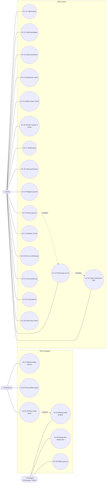

# 03 — Use Case

## 1. Diagram Use Case

GitHub tidak mendukung diagram use case UML secara native, jadi diagram di bawah memakai Mermaid flowchart. Versi UML formalnya (PlantUML, untuk laporan) ada di [`diagrams/use-case.puml`](diagrams/use-case.puml).

> Pelanggan adalah Pengunjung yang sudah lolos UC-03 (generalisasi). Semua use case internal mensyaratkan UC-10 (login).

## 2. Skenario Use Case Utama

### UC-03 Verifikasi Kode Servis
| Elemen | Isi |
|---|---|
| Aktor | Pengunjung |
| Prakondisi | Servis dengan kode tersebut ada |
| Pemicu | Klik kartu di papan / buka link `/cek/{kode}` dari QR atau WhatsApp |
| Alur utama | 1. Sistem menampilkan form kode (4 digit) & 4 digit akhir HP (kode terisi otomatis bila dari link). 2. Pengunjung mengisi lalu menekan **Cek Progres**. 3. Sistem mencocokkan kode + 4 digit akhir HP. 4. Sistem menyimpan sesi verifikasi (cookie) dan mengarahkan ke halaman detail (UC-04) |
| Alur alternatif | 3a. Tidak cocok: sistem menampilkan pesan generik "Kode atau nomor tidak cocok", lalu kembali ke langkah 1. 2a. Format bukan 4 digit angka: validasi di sisi klien & server |
| Pascakondisi | Pengunjung menjadi Pelanggan untuk servis itu |
| Ref | FR-P05, FR-P06, FR-P13, BR-02 |

> Catatan: kartu papan hanya membawa **ID publik acak** (bukan kode servis). Jika verifikasi dimulai dari kartu, sistem memeriksa bahwa kode + 4 digit HP cocok **dengan servis pada kartu itu**, sehingga kode tetap berfungsi sebagai kunci.

### UC-04 Melihat Detail Progres
| Elemen | Isi |
|---|---|
| Aktor | Pelanggan |
| Prakondisi | Lolos UC-03 |
| Alur utama | 1. Sistem menampilkan ringkasan servis (mobil, tanggal masuk, estimasi selesai). 2. Untuk tiap modul: status, progress bar, timeline catatan & media publik. 3. Rincian biaya, pembayaran, status bayar. 4. Garansi per modul (bila ada). 5. Tombol unduh nota/invoice |
| Alur alternatif | 2a. Belum ada catatan: tampil "Unit telah diterima, menunggu diagnosa". 4a. Ada klaim garansi tertaut: tampil tautan "Servis asal" atau "Klaim garansi" |
| Ref | FR-P07 – FR-P12, BR-10 |

### UC-14 Penerimaan Servis
| Elemen | Isi |
|---|---|
| Aktor | Admin |
| Prakondisi | Admin login |
| Alur utama | 1. Admin mencari pelanggan via No. HP. 2. Jika ada, sistem menampilkan pelanggan + kendaraannya; jika tidak ada, admin membuat pelanggan baru. 3. Admin memilih/membuat kendaraan, atau memilih "Modul saja" tanpa kendaraan. 4. Admin mengisi jenis penerimaan, cara masuk (+ No. resi bila ekspedisi), estimasi selesai, catatan kondisi. 5. Admin menambah ≥ 1 modul (jenis, detail, keluhan). 6. Admin menyimpan. 7. Sistem membuat kode 4 digit unik, status modul `DITERIMA`, entri timeline pertama. 8. Sistem menampilkan halaman servis dengan tombol **Nota PDF** & **Kirim via WhatsApp** |
| Alur alternatif | 5a. Tanpa modul: simpan ditolak. 7a. Kode bentrok: sistem mengulang acak. 7b. Kapasitas kode < 10%: tampil peringatan |
| Ref | FR-S01 – FR-S03, FR-S13, FR-S15, BR-01 |

### UC-15 Update Status Modul
| Elemen | Isi |
|---|---|
| Aktor | Admin |
| Alur utama | 1. Admin membuka servis/kanban dan memilih modul. 2. Sistem hanya menampilkan status tujuan yang valid (BR-03). 3. Admin memilih status, opsional menambah catatan/foto. 4. Sistem menyimpan dan menambah entri timeline publik |
| Alur alternatif | 3a. Pilih `BATAL`: alasan wajib (UC-21). 3b. Pilih `SELESAI` padahal belum lunas: ditolak kecuali dengan alasan override (BR-06). 3c. Pilih `SIAP_DIAMBIL`: sistem meminta masa garansi (UC-19) & menawarkan tombol WA "siap diambil" |
| Ref | FR-S04, FR-S09, FR-S10, BR-03, BR-06 |

### UC-16 Tambah Catatan & Media
| Elemen | Isi |
|---|---|
| Aktor | Admin |
| Alur utama | 1. Admin menulis catatan (contoh: "Proses solder ulang jalur IC power"). 2. Admin melampirkan foto/video dari kamera/galeri. 3. Admin mengatur toggle publik untuk catatan & tiap media (default: publik untuk catatan, **privat** untuk media sampai ditinjau). 4. Sistem mengompres foto & menyimpan |
| Alur alternatif | 2a. File melebihi batas/format tidak didukung: ditolak dengan pesan |
| Ref | FR-S05, FR-S06, NFR-02, BR-10 |

### UC-17 & UC-18 Kelola Biaya dan Pembayaran
| Elemen | Isi |
|---|---|
| Aktor | Admin |
| Alur utama | 1. Admin menambah item (jenis, deskripsi, qty, harga, opsional terkait modul). 2. Sistem menghitung ulang total & status bayar. 3. Saat pelanggan membayar, admin mencatat nominal, metode, tanggal. 4. Sistem memperbarui status bayar (BR-05) |
| Alur alternatif | 1a. Servis terkunci (BR-07): item tidak bisa diubah. 3a. Nominal ≤ 0: ditolak |

### UC-20 Klaim Garansi
| Elemen | Isi |
|---|---|
| Aktor | Admin |
| Alur utama | 1. Admin membuka servis lama (cari via kode/HP). 2. Admin memilih modul bergaransi aktif → **Klaim Garansi**. 3. Sistem membuat servis baru (kode baru) yang tertaut ke servis asal, dengan pelanggan/kendaraan/modul tersalin dan label *Klaim Garansi*. 4. Alur berlanjut seperti UC-14 langkah 7–8 |
| Alur alternatif | 2a. Garansi habis: tombol nonaktif, admin bisa membuat servis biasa |
| Ref | FR-S11, BR-08 |
