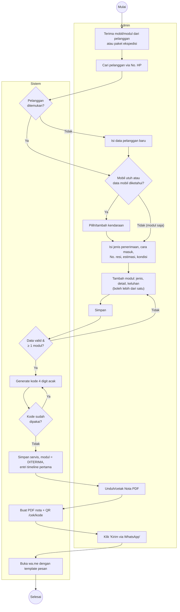
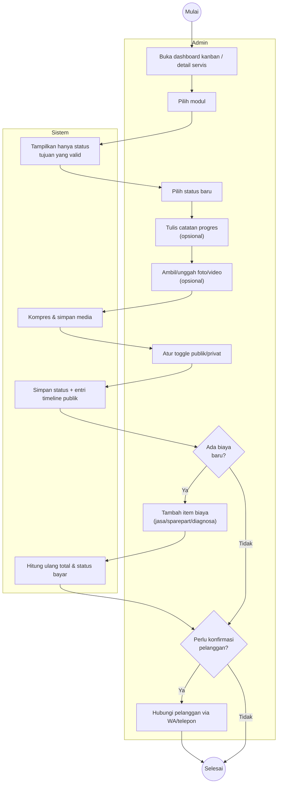
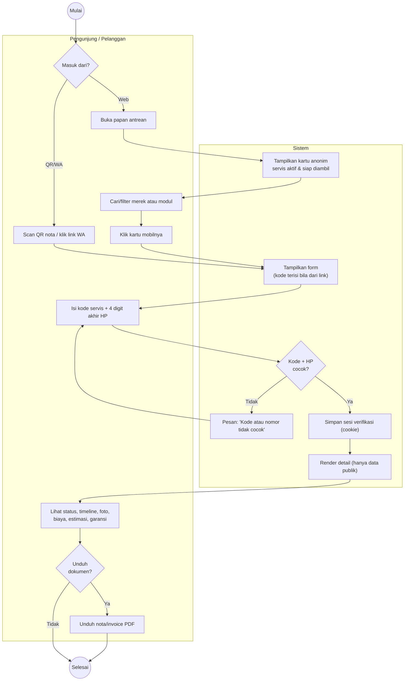
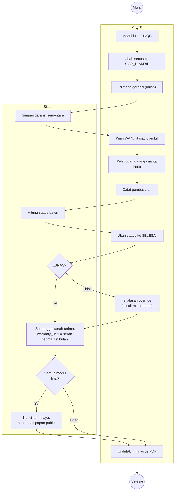
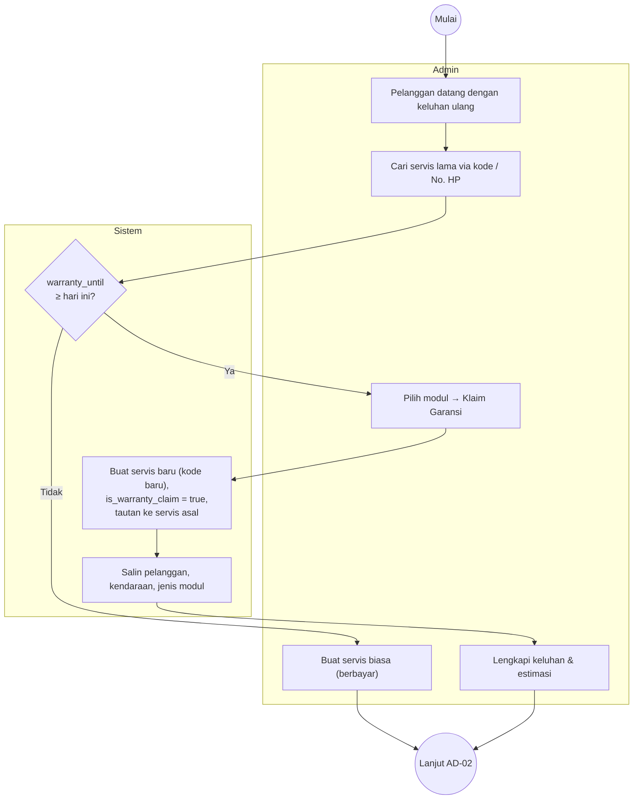
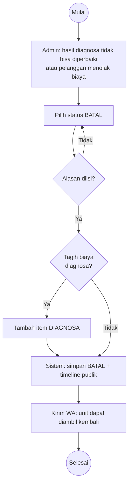

# 04 — Activity Diagram

Diagram ditulis dalam Mermaid agar langsung tampil di GitHub. *Swimlane* digambarkan dengan `subgraph`.

## AD-01 Penerimaan Servis (UC-14)

## AD-02 Pengerjaan & Update Progres (UC-15, UC-16, UC-17)

## AD-03 Pelanggan Memantau Progres (UC-01 s.d. UC-06)

## AD-04 Penyelesaian, Pembayaran & Garansi (UC-18, UC-19, UC-22, UC-23)

## AD-05 Klaim Garansi (UC-20)

## AD-06 Pembatalan / Tidak Bisa Diperbaiki (UC-21)

