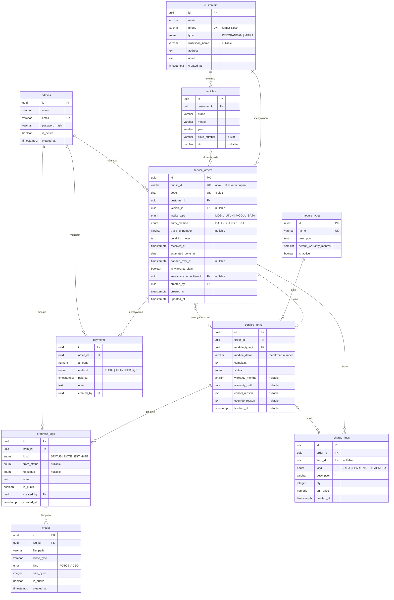

# 05 — ERD & Kamus Data

DBMS: **PostgreSQL 16**, diakses lewat Prisma ORM. Konvensi: nama tabel `snake_case` jamak, PK `id`, timestamp `timestamptz`, uang `numeric(12,0)` (rupiah tanpa desimal).

## 1. ERD

## 2. Enum

| Enum | Nilai |
|---|---|
| `customer_type` | `PERORANGAN`, `MITRA` |
| `intake_type` | `MOBIL_UTUH`, `MODUL_SAJA` |
| `entry_method` | `DATANG`, `EKSPEDISI` |
| `item_status` | `DITERIMA`, `DIAGNOSA`, `MENUNGGU_PERSETUJUAN`, `MENUNGGU_SPAREPART`, `PERBAIKAN`, `UJI_QC`, `SIAP_DIAMBIL`, `SELESAI`, `BATAL` |
| `log_kind` | `STATUS`, `NOTE`, `ESTIMATE` |
| `media_kind` | `FOTO`, `VIDEO` |
| `charge_kind` | `JASA`, `SPAREPART`, `DIAGNOSA` |
| `payment_method` | `TUNAI`, `TRANSFER`, `QRIS` |

## 3. Kamus Data

### `customers`
| Kolom | Tipe | Null | Keterangan |
|---|---|---|---|
| id | uuid | ✗ | PK |
| name | varchar(100) | ✗ | Nama pelanggan / PIC bengkel |
| phone | varchar(16) | ✗ | Unik, E.164 tanpa `+` (contoh `6281234567890`). 4 digit terakhir dipakai untuk verifikasi |
| type | customer_type | ✗ | Default `PERORANGAN` |
| workshop_name | varchar(100) | ✓ | Wajib bila `type = MITRA` |
| address | text | ✓ | |
| notes | text | ✓ | Catatan internal |

### `vehicles`
| Kolom | Tipe | Null | Keterangan |
|---|---|---|---|
| customer_id | uuid | ✗ | FK → customers |
| brand | varchar(50) | ✗ | Contoh: Toyota |
| model | varchar(50) | ✗ | Contoh: Avanza |
| year | smallint | ✓ | |
| plate_number | varchar(15) | ✓ | **Privat**, tidak pernah tampil di web publik |
| vin | varchar(20) | ✓ | Nomor rangka |

> Untuk mitra, kendaraan disimpan di bawah pelanggan mitra (kendaraan milik pelanggan si bengkel).

### `module_types`
| Kolom | Tipe | Null | Keterangan |
|---|---|---|---|
| name | varchar(50) | ✗ | Unik. Seed: ECU, BCM, EPS, Speedometer/Cluster, ABS, Airbag (SRS), TCM, Immobilizer, Lainnya |
| default_warranty_months | smallint | ✓ | Saran garansi default saat modul selesai |
| is_active | boolean | ✗ | Nonaktif = tidak muncul di pilihan baru |

### `service_orders`
| Kolom | Tipe | Null | Keterangan |
|---|---|---|---|
| public_id | varchar(12) | ✗ | Unik, acak (nanoid). Dipakai pada kartu papan publik (`/u/{public_id}`) |
| code | char(4) | ✗ | Unik, angka acak `0000`–`9999`, permanen (BR-01) |
| customer_id | uuid | ✗ | FK |
| vehicle_id | uuid | ✓ | Null bila modul saja tanpa data mobil |
| intake_type | intake_type | ✗ | |
| entry_method | entry_method | ✗ | |
| tracking_number | varchar(50) | ✓ | No. resi bila ekspedisi |
| condition_notes | text | ✓ | Kondisi fisik saat diterima |
| received_at | timestamptz | ✗ | Default `now()` |
| estimated_done_at | date | ✓ | Estimasi selesai |
| handed_over_at | timestamptz | ✓ | Waktu serah terima, dasar hitung garansi |
| is_warranty_claim | boolean | ✗ | Default `false` |
| warranty_source_item_id | uuid | ✓ | FK → service_items (modul asal yang diklaim) |

### `service_items`
| Kolom | Tipe | Null | Keterangan |
|---|---|---|---|
| order_id | uuid | ✗ | FK, `ON DELETE CASCADE` |
| module_type_id | uuid | ✗ | FK |
| module_detail | varchar(100) | ✓ | Contoh: "Denso 89661-0K..." |
| complaint | text | ✗ | Keluhan |
| status | item_status | ✗ | Default `DITERIMA` |
| warranty_months | smallint | ✓ | Diisi saat `SIAP_DIAMBIL` |
| warranty_until | date | ✓ | `handed_over_at + warranty_months` |
| cancel_reason | text | ✓ | Wajib bila `BATAL` |
| override_reason | text | ✓ | Alasan `SELESAI` sebelum lunas |
| finished_at | timestamptz | ✓ | Waktu mencapai status final |

### `progress_logs`
| Kolom | Tipe | Null | Keterangan |
|---|---|---|---|
| item_id | uuid | ✗ | FK |
| kind | log_kind | ✗ | `STATUS` dibuat otomatis saat status berubah |
| from_status / to_status | item_status | ✓ | Diisi bila `kind = STATUS` |
| note | text | ✓ | Catatan bebas |
| is_public | boolean | ✗ | `STATUS` selalu `true` |

### `media`
| Kolom | Tipe | Null | Keterangan |
|---|---|---|---|
| log_id | uuid | ✗ | FK |
| file_path | varchar(255) | ✗ | Path relatif di volume media (contoh `2026/10/<uuid>.webp`) |
| mime_type | varchar(50) | ✗ | `image/webp`, `video/mp4` |
| size_bytes | integer | ✗ | Validasi batas (NFR-02) |
| is_public | boolean | ✗ | Default `false` (perlu ditinjau admin) |

### `charge_lines`
| Kolom | Tipe | Null | Keterangan |
|---|---|---|---|
| order_id | uuid | ✗ | FK |
| item_id | uuid | ✓ | Modul terkait (opsional) |
| kind | charge_kind | ✗ | |
| description | varchar(150) | ✗ | Contoh: "IC driver injector" |
| qty | integer | ✗ | ≥ 1 |
| unit_price | numeric(12,0) | ✗ | ≥ 0 |

### `payments`
| Kolom | Tipe | Null | Keterangan |
|---|---|---|---|
| order_id | uuid | ✗ | FK |
| amount | numeric(12,0) | ✗ | > 0 |
| method | payment_method | ✗ | |
| paid_at | timestamptz | ✗ | |

## 4. Nilai Turunan (tidak disimpan)
| Nilai | Rumus |
|---|---|
| Total biaya | `SUM(qty * unit_price)` dari `charge_lines` |
| Total dibayar | `SUM(amount)` dari `payments` |
| Status bayar | BR-05 |
| Status servis | Aktif bila ada `service_items.status NOT IN (SELESAI, BATAL)` |
| Status garansi | `warranty_until >= CURRENT_DATE` → Berlaku |

## 5. Indeks
| Tabel | Indeks | Alasan |
|---|---|---|
| service_orders | `UNIQUE(code)`, `UNIQUE(public_id)` | Verifikasi & kartu publik |
| customers | `UNIQUE(phone)` | Pencarian admin |
| service_items | `(status)`, `(order_id)` | Papan publik & kanban |
| progress_logs | `(item_id, created_at)` | Timeline |
| payments, charge_lines | `(order_id)` | Hitung total |
