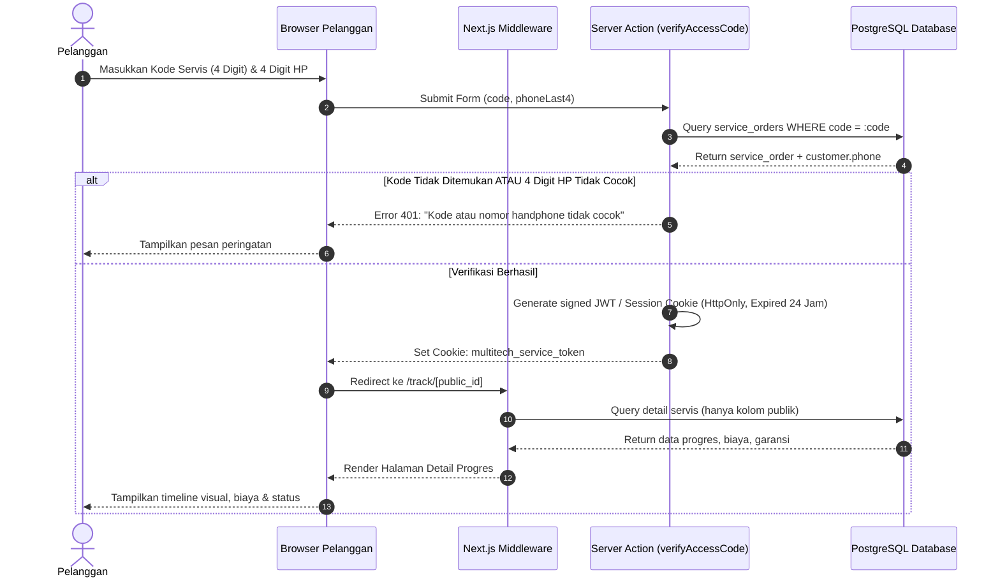
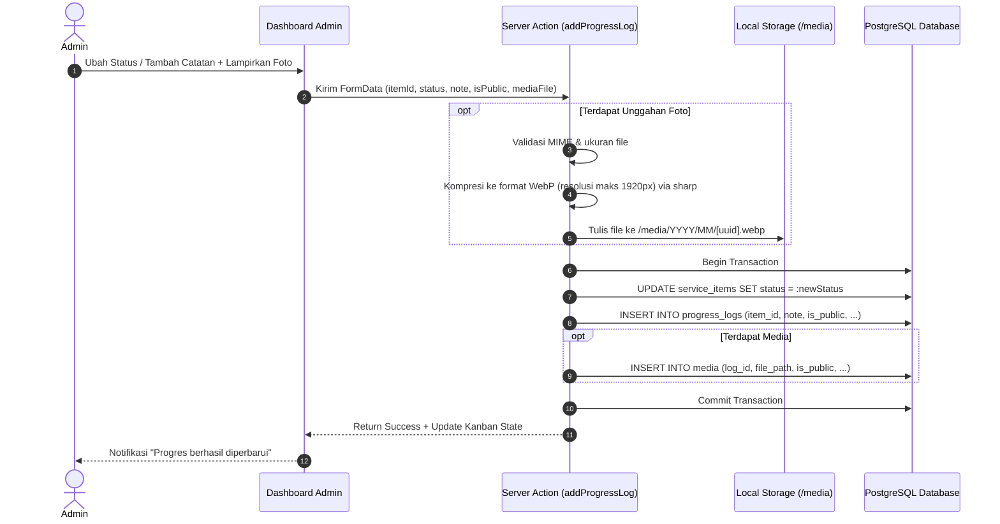

# 06 — Arsitektur Sistem & Infrastruktur

## 1. Ikhtisar Arsitektur
Sistem Multitech dikembangkan menggunakan arsitektur **Monolith Modern** berbasis Next.js App Router (TypeScript). Kedua sisi web (Web Publik Pelanggan dan Web Internal Admin) diakomodasi dalam satu basis kode dan satu basis data PostgreSQL, namun dipisahkan secara logis pada lapisan perutean (*routing*) melalui Subdomain Middleware.

```mermaid
flowchart TD
    subgraph Klien["Perangkat Pengguna"]
        P["Smartphone Pelanggan<br/>(Web Publik)"]
        A["Laptop/HP Admin<br/>(Web Internal)"]
    end

    subgraph CDN["Cloudflare Edge Network"]
        CF["Cloudflare DNS & WAF<br/>(HTTPS / SSL Auto Termination)"]
        CF_R["Rate Limiting & DDoS Shield"]
    end

    subgraph HomeServer["Ubuntu Linux Server (Self-Hosted)"]
        TUN["Cloudflare Tunnel (cloudflared daemon)"]
        
        subgraph Docker["Docker Compose Environment"]
            NEXT["Next.js Application Container (Node.js runtime)<br/>- App Router & Server Actions<br/>- Subdomain Routing Middleware<br/>- PDF Generator (@react-pdf)"]
            PG[("PostgreSQL 16 Database Container")]
            VOL_MEDIA[("Docker Shared Volume<br/>/var/data/multitech/media")]
            VOL_DB[("Docker Persistent Volume<br/>/var/lib/postgresql/data")]
        end

        CRON["Linux Cron Service<br/>(Automated pg_dump Backup)"]
    end

    P -->|HTTPS: multitech.xxx| CF
    A -->|HTTPS: admin.multitech.xxx| CF
    CF --> CF_R --> TUN
    TUN -->|Internal Bridge| NEXT
    NEXT -->|Prisma Client (TCP 5432)| PG
    NEXT -->|Local FS Read/Write| VOL_MEDIA
    PG --> VOL_DB
    CRON -->|Daily Backup| PG
```

---

## 2. Strategi Pemisahan Domain (Subdomain Routing)

Untuk memenuhi kebutuhan "dua web" tanpa beban pemeliharaan dua aplikasi terpisah, Next.js Middleware memeriksa *header* `Host`:

```typescript
// middleware.ts (Konsep Alur)
import { NextRequest, NextResponse } from 'next/server';

export function middleware(req: NextRequest) {
  const hostname = req.headers.get('host') || '';
  const url = req.nextUrl;

  // Jika request berasal dari admin.multitech.*
  if (hostname.startsWith('admin.')) {
    // Rewrite path internal ke folder /(admin)
    url.pathname = `/admin${url.pathname}`;
    return NextResponse.rewrite(url);
  }

  // Jika request berasal dari web publik multitech.*
  // Rewrite path internal ke folder /(public)
  url.pathname = `/public${url.pathname}`;
  return NextResponse.rewrite(url);
}
```

Struktur folder App Router:
```text
src/
├── app/
│   ├── (public)/              # Rute untuk web pelanggan (multitech.xxx)
│   │   ├── page.tsx           # Papan antrean publik (anonim)
│   │   ├── cek/
│   │   │   └── [code]/page.tsx# Form verifikasi kode + No. HP
│   │   ├── track/
│   │   │   └── [id]/page.tsx  # Detail progres, biaya, garansi, unduh invoice
│   │   └── layout.tsx
│   ├── (admin)/               # Rute untuk admin (admin.multitech.xxx)
│   │   ├── admin/
│   │   │   ├── login/page.tsx # Halaman login admin
│   │   │   ├── dashboard/     # Papan kanban status servis
│   │   │   ├── services/      # Input servis baru, update status, biaya, media
│   │   │   ├── customers/     # Master data pelanggan & kendaraan
│   │   │   ├── reports/       # Laporan pendapatan & statistik modul
│   │   │   └── settings/      # Master jenis modul & kelola akun admin
│   │   └── layout.tsx
│   └── api/                   # Endpoint download media terproteksi & PDF stream
├── components/                # Komponen UI murni Tailwind (tanpa shadcn)
│   ├── public/                # Header publik, kartu antrean, stepper timeline
│   ├── admin/                 # Tabel data, kanban board, form modal
│   └── shared/                # Badge status, modal konfirmasi, format rupiah
├── lib/
│   ├── db.ts                  # Inisialisasi Prisma Client singleton
│   ├── auth.ts                # Session management & verifikasi password
│   ├── storage.ts             # Manajemen penyimpanan & kompresi WebP (sharp)
│   └── pdf/                   # Template React-PDF untuk nota & invoice
└── prisma/
    └── schema.prisma          # Skema basis data terpadu
```

---

## 3. Sequence Diagram Alur Data Kritis

### 3.1 Verifikasi Pelanggan & Penerbitan Token Sesi Akses



### 3.2 Update Progres & Unggah Foto oleh Admin



---

## 4. Keamanan & Perlindungan Data Pribadi (UU PDP No. 27/2022)

1. **Privasi Papan Antrean:**
   - Tidak ada transmisi data identitas pribadi (*PII*) seperti nama pelanggan, nomor telepon, dan nomor plat polisi ke endpoint halaman publik papan antrean.
   - Papan publik hanya merender: *Merek Mobil*, *Tipe*, *Tahun*, *Jenis Modul*, dan *Status Terkini*.
2. **Isolasi Media Pemeriksaan:**
   - Unggahan foto secara *default* diset `is_public = false`.
   - Admin wajib mengonfirmasi toggle visibilitas sebelum foto dapat diakses oleh publik untuk mencegah tereksposnya plat nomor atau dokumen pelanggan yang tidak sengaja terfoto.
3. **Penyimpanan Kredensial:**
   - Password admin disimpan menggunakan algoritma *Argon2id* atau *Bcrypt* dengan cost factor 12.
4. **Proteksi Jaringan Server Rumahan:**
   - Menggunakan Cloudflare Tunnel sehingga server Ubuntu lokal **tidak memerlukan port forwarding** atau IP publik statis.
   - Port 80 dan 443 pada router internet rumah tetap tertutup sepenuhnya dari pemindaian publik luar.

---

## 5. Rencana Backup & Disaster Recovery

- **Database:** Skrip terjadwal via Linux `crontab` menjalankan `pg_dump` setiap hari pukul 02:00 WIB, mengompresi arsip `.sql.gz`, dan menyimpan retensi 14 hari terakhir.
- **Media:** Folder `/var/data/multitech/media` disinkronkan secara inkremental ke penyimpanan terpisah (harddisk eksternal atau S3-compatible cloud storage).
