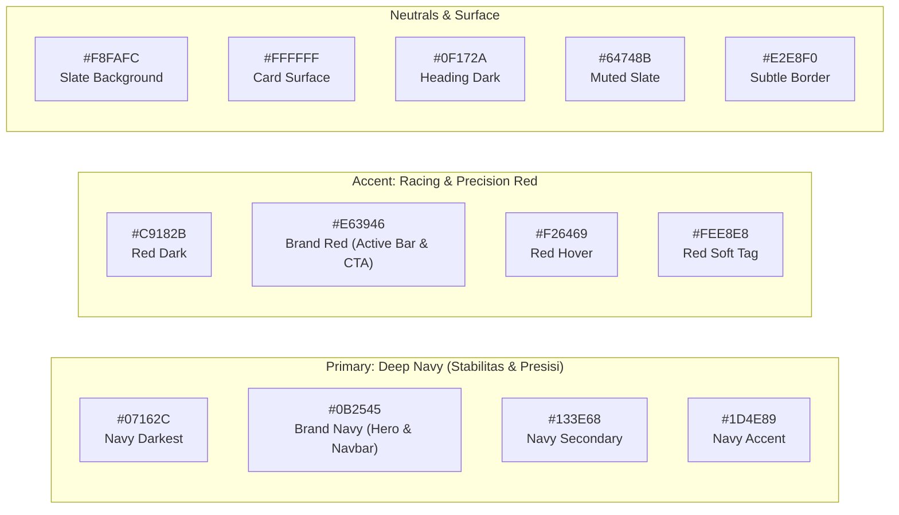

# 07 — Design System & Wireframe (Branding Multitech)

## 1. Filosofi & Karakter Visual

Desain sistem Multitech mengadopsi identitas visual yang profesional, terpercaya, dan berkarakter teknologi otomotif modern. Berdasarkan panduan visual resmi Multitech (Tasikmalaya), tema utama memadukan warna **Navy Gelap (Deep Tech Navy)** yang kokoh dengan aksen **Merah Dinamis (Dynamic Red)** yang merepresentasikan presisi dan ketelitian komponen elektronika kendaraan.

Desain dibangun menggunakan **Tailwind CSS murni** dengan komponen terisolasi tanpa dependensi UI eksternal (tanpa shadcn/ui), menghasilkan performa rendering maksimal dan kontrol penuh atas aksesibilitas.

---

## 2. Palet Warna (Color Tokens)



### Konfigurasi Tailwind (`tailwind.config.ts`)
```typescript
export const multitechColors = {
  navy: {
    DEFAULT: '#0B2545', // Warna utama navbar, hero, header kanban
    dark: '#07162C',    // Background footer & dark surfaces
    light: '#133E68',   // Border kontras & hover card
  },
  crimson: {
    DEFAULT: '#E63946', // Garis aksen aktif, badge status urgent, tombol utama
    hover: '#C9182B',   // State hover CTA
    light: '#FEE8E8',   // Latar belakang badge / alert info
  },
  surface: {
    bg: '#F8FAFC',      // Background canvas publik & dashboard
    card: '#FFFFFF',    // Kontainer kartu servis
    muted: '#F1F5F9',   // Background input & strip antrean
  },
  status: {
    waiting: { bg: '#FEF3C7', text: '#92400E', border: '#FDE68A' }, // Kuning (Menunggu)
    process: { bg: '#E0E7FF', text: '#3730A3', border: '#C7D2FE' }, // Biru/Indigo (Perbaikan/Solder)
    testing: { bg: '#F3E8FF', text: '#6B21A8', border: '#E9D5FF' }, // Ungu (Uji/QC)
    ready:   { bg: '#DCFCE7', text: '#166534', border: '#BBF7D0' }, // Hijau (Siap Diambil)
    cancel:  { bg: '#FEE2E2', text: '#991B1B', border: '#FECACA' }, // Merah (Batal/Gagal)
  }
};
```

---

## 3. Tipografi
- **Font Utama:** `Plus Jakarta Sans` atau `Inter` (Sans-serif modern, mudah dibaca pada layar kecil teknisi maupun pelanggan).
- **Font Monospace:** `JetBrains Mono` untuk kode servis 4-digit, nomor part ECU, dan serial modul.
- **Skala Hirarki:**
  - H1: `text-3xl md:text-4xl font-extrabold tracking-tight` (Judul Halaman / Hero)
  - H2: `text-xl md:text-2xl font-bold` (Nama Modul, Section Header)
  - H3 / Tagline: `text-xs md:text-sm font-semibold tracking-wider uppercase text-crimson` (Label kategori kecil)
  - Body: `text-sm md:text-base text-slate-700 leading-relaxed`

---

## 4. Komponen Kustom Utama (Pure Tailwind)

### 4.1 Kartu Antrean Publik (Anonim)
Komponen kartu untuk web publik tanpa memperlihatkan data sensitif (nama/nomor plat):
```html
<div class="rounded-xl border border-slate-200 bg-white p-5 shadow-sm hover:shadow-md transition-shadow">
  <div class="flex items-center justify-between border-b border-slate-100 pb-3">
    <span class="text-xs font-semibold uppercase tracking-wider text-crimson">
      Masuk: 03 Okt 2026
    </span>
    <span class="inline-flex items-center rounded-full bg-indigo-100 px-2.5 py-0.5 text-xs font-medium text-indigo-800">
      Perbaikan
    </span>
  </div>
  <div class="mt-4">
    <h3 class="text-lg font-bold text-navy">Toyota Avanza (2015)</h3>
    <div class="mt-2 flex flex-wrap gap-1.5">
      <span class="rounded bg-slate-100 px-2 py-0.5 text-xs font-mono text-slate-700">Modul: ECU Denso</span>
      <span class="rounded bg-slate-100 px-2 py-0.5 text-xs font-mono text-slate-700">Speedometer</span>
    </div>
  </div>
  <button class="mt-5 w-full rounded-lg bg-navy py-2.5 text-center text-xs font-semibold text-white hover:bg-navy-light transition-colors">
    Cek Progres Detail &rarr;
  </button>
</div>
```

### 4.2 Stepper Progres Servis (Timeline Visual)
Status per modul dengan ikon status dan garis alur interaktif:
1. **Diterima** (Hijau centang)
2. **Diagnosa** (Hijau centang)
3. **Perbaikan** (Biru aktif berkedip)
4. **Uji / QC** (Abu-abu standby)
5. **Siap Diambil** (Abu-abu standby)

---

## 5. Wireframe Konseptual

### 5.1 Web Pelanggan — Halaman Beranda & Papan Antrean
```text
+-----------------------------------------------------------------------+
| [ MULTITECH ]                                   Beranda  Cek Progres  |
+-----------------------------------------------------------------------+
|  HERO BANNER (Background: Brand Navy #0B2545)                         |
|  PAPAN PANTAU PROGRES SERVIS ELEKTRONIK MOBIL                         |
|  Transparansi perbaikan ECU, BCM, EPS, dan Speedometer di Tasikmalaya |
|                                                                       |
|  [ Cari berdasarkan merek mobil / jenis modul... ] [ Filter Status v ]|
+-----------------------------------------------------------------------+
|                                                                       |
|  ANTREAN UNIT AKTIF (Anonim & Real-Time)                              |
|                                                                       |
|  +------------------------+  +------------------------+               |
|  | Masuk: 03 Okt | [PROSES]|  | Masuk: 04 Okt | [QC]   |               |
|  | Toyota Avanza 2015     |  | Honda Jazz RS 2018     |               |
|  | Modul: ECU             |  | Modul: EPS Module      |               |
|  | [ Cek Detail Unit ]    |  | [ Cek Detail Unit ]    |               |
|  +------------------------+  +------------------------+               |
|                                                                       |
+-----------------------------------------------------------------------+
```

### 5.2 Modal Input Verifikasi (Saat Kartu Diklik / Scan QR)
```text
+-------------------------------------------------------+
|              VERIFIKASI AKSES PROGRES                 |
|                                                       |
|  Masukkan 4 Digit Kode Servis yang tertera pada nota  |
|  dan 4 Digit Terakhir Nomor Handphone Anda.           |
|                                                       |
|  Kode Servis (4 Digit)   : [  4  8  2  1  ]           |
|  4 Digit Terakhir No. HP : [  5  6  7  8  ]           |
|                                                       |
|              [  LIHAT STATUS PROGRES  ]               |
+-------------------------------------------------------+
```

### 5.3 Web Pelanggan — Halaman Detail Progres
```text
+-----------------------------------------------------------------------+
| < Kembali ke Antrean                Unit: Toyota Avanza 2015          |
| Tanggal Masuk: 03 Okt 2026          Estimasi Selesai: 09 Okt 2026     |
+-----------------------------------------------------------------------+
| MODUL 1: ECU Denso (Status: PERBAIKAN)                                |
| [v Diterima] -> [v Diagnosa] -> [* Perbaikan] -> [o QC] -> [o Selesai]|
|                                                                       |
| TIMELINE PEKERJAAN & FOTO BUKTI:                                      |
| - 05 Okt 14:20 : Komponen IC Power baru tiba. Selesai solder jalur.   |
|   [ Foto PCB Setelah Solder ]                                         |
| - 04 Okt 10:15 : Ditemukan jalur putus akibat tegangan berlebih.      |
|   [ Foto Jalur Terbakar ]                                             |
+-----------------------------------------------------------------------+
| RINCIAN BIAYA & PEMBAYARAN                                            |
| 1. Jasa Diagnosa & Analisa Sirkuit ........... Rp 150.000             |
| 2. IC Power Replacement ....................... Rp 450.000             |
| 3. Jasa Solder & Pemrograman Ulang ........... Rp 300.000             |
| -------------------------------------------------------------         |
| TOTAL BIAYA : Rp 900.000       STATUS: DP (Rp 300.000)                |
| SISA TAGIHAN: Rp 600.000                                              |
|                                                                       |
| [ Unduh Nota Tanda Terima (PDF) ]   [ Unduh Invoice Sementara ]       |
+-----------------------------------------------------------------------+
| MASA GARANSI SERVIS:                                                  |
| Garansi Modul ECU berlaku selama 3 Bulan setelah unit diambil.        |
+-----------------------------------------------------------------------+
```

### 5.4 Web Admin — Dashboard Kanban Progres
```text
+-----------------------------------------------------------------------+
| MULTITECH ADMIN | [Kanban] [Penerimaan] [Pelanggan] [Biaya] [Laporan] |
+-----------------------------------------------------------------------+
| [+ Terima Servis Baru]                       Pencarian: [ Cari unit..]|
+-------------------+-------------------+-------------------+-----------+
| DITERIMA (2)      | PERBAIKAN (4)     | UJI / QC (1)      | SIAP (3)  |
+-------------------+-------------------+-------------------+-----------+
| #4821 - Avanza    | #7312 - Innova    | #1903 - Civic     | #8821 ... |
| ECU (Cek IC)      | Speedometer       | BCM Modul         | EPS Motor |
| [Update Progres]  | [Update Progres]  | [Update Progres]  | [Kirim WA]|
+-------------------+-------------------+-------------------+-----------+
```
