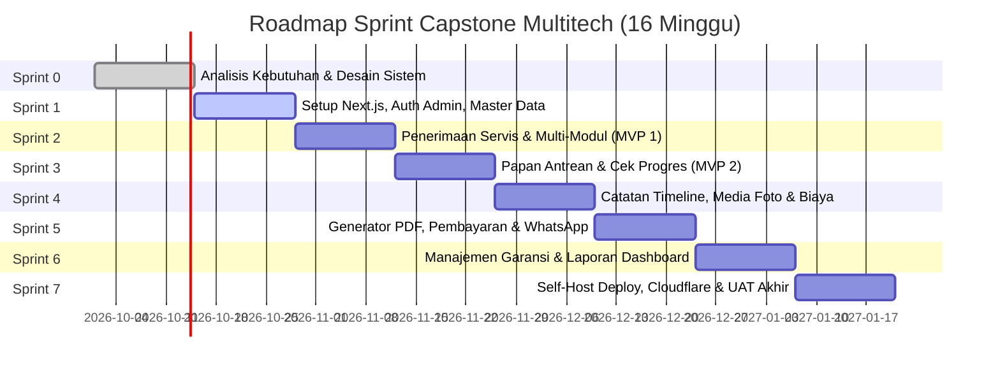

# 08 — Product Backlog & Rencana Sprint (Scrum)

## 1. Metodologi Pengembangan: Scrum
Pengembangan dilakukan menggunakan kerangka kerja **Scrum** dengan durasi sprint **2 minggu per sprint** selama total **16 minggu (8 Sprint: Sprint 0 s.d. Sprint 7)**.

- **Tim:** 2–3 Orang Mahasiswa Capstone
- **Product Owner & Mitra:** Multitech (Tasikmalaya)
- **Scrum Master & Tim Pengembang:** Mahasiswa Capstone

---

## 2. Product Backlog Items (PBI) & Story Points

Estimasi menggunakan deret Fibonacci (*Planning Poker*): 1, 2, 3, 5, 8, 13.

| ID | Kategori | User Story | Prioritas | SP | Target Sprint |
|---|---|---|---|---|---|
| US-01 | Analisis | Sebagai tim, kami membutuhkan dokumen PRD, SRS, ERD, dan diagram UML agar arah arsitektur terdefinisi jelas. | High | 5 | Sprint 0 |
| US-02 | Pondasi | Sebagai admin, saya ingin login menggunakan kredensial aman agar akses dashboard terlindungi. | High | 3 | Sprint 1 |
| US-03 | Master Data | Sebagai admin, saya ingin mengelola master data pelanggan & jenis modul agar data servis terstruktur. | High | 5 | Sprint 1 |
| US-04 | Penerimaan | Sebagai admin, saya ingin menginput penerimaan servis (multi-modul) dan menghasilkan kode 4-digit acak unik. | High | 8 | Sprint 2 |
| US-05 | Status Modul | Sebagai admin, saya ingin memperbarui status tahapan tiap modul secara independen sesuai alur standar. | High | 5 | Sprint 2 |
| US-06 | Papan Publik | Sebagai pengunjung/pelanggan, saya ingin melihat papan antrean mobil yang sedang diservis secara anonim tanpa login. | High | 8 | Sprint 3 |
| US-07 | Cek Progres | Sebagai pelanggan, saya ingin memverifikasi kode 4-digit + 4 digit HP agar dapat membuka detail progres kendaraan saya. | High | 5 | Sprint 3 |
| US-08 | Timeline & Foto | Sebagai admin, saya ingin mengunggah foto PCB/komponen dengan toggle publik agar pelanggan dapat melihat bukti fisik. | Medium | 8 | Sprint 4 |
| US-09 | Rincian Biaya | Sebagai admin, saya ingin menambahkan rincian biaya (jasa/sparepart) bertahap agar total biaya selalu transparan. | High | 5 | Sprint 4 |
| US-10 | Nota PDF | Sebagai admin & pelanggan, saya ingin mengunduh nota tanda terima ber-QR code dalam format PDF. | Medium | 5 | Sprint 5 |
| US-11 | Pembayaran | Sebagai admin, saya ingin mencatat pembayaran DP/lunas (tunai/transfer/QRIS) dengan kalkulasi otomatis. | High | 5 | Sprint 5 |
| US-12 | WhatsApp Link | Sebagai admin, saya ingin menekan tombol WhatsApp yang otomatis membuka template chat ke pelanggan tanpa API berbayar. | Medium | 3 | Sprint 5 |
| US-13 | Garansi Servis | Sebagai admin, saya ingin menetapkan masa garansi per modul dan memproses klaim garansi terkait. | High | 5 | Sprint 6 |
| US-14 | Dashboard & Laporan | Sebagai pemilik, saya ingin melihat ringkasan pendapatan, modul terbanyak, dan kanban antrean servis. | Medium | 8 | Sprint 6 |
| US-15 | Rilis & Deploy | Sebagai tim, kami ingin mendeploy sistem ke server Ubuntu di rumah menggunakan Docker & Cloudflare Tunnel. | High | 8 | Sprint 7 |
| US-16 | Pengujian & UAT | Sebagai tim, kami ingin melakukan uji Black Box dan UAT bersama pihak Multitech untuk mengukur skor SUS. | High | 5 | Sprint 7 |

**Total Story Points:** 91 SP  
**Kecepatan Rata-rata (*Velocity*):** ± 11–13 SP per sprint.

---

## 3. Rencana Sprint (Sprint Roadmap)

### Rincian Tujuan Sprint (Sprint Goals):
- **Sprint 0 (Minggu 1–2):** Finalisasi dokumen spesifikasi (PRD, SRS, ERD, Use Case, Activity Diagram, Arsitektur, Wireframe).
- **Sprint 1 (Minggu 3–4):** Inisialisasi repositori, Prisma migration awal, login admin, CRUD data master pelanggan, kendaraan, dan jenis modul.
- **Sprint 2 (Minggu 5–6):** Fitur input penerimaan unit servis (mobil utuh/modul), logika pembuatan kode 4-digit unik, dan manajemen status tahapan modul. *(Capaian: Core Internal Operational).*
- **Sprint 3 (Minggu 7–8):** Antarmuka web pelanggan (papan antrean publik anonim), form modal verifikasi kode + 4 digit HP, dan tampilan stepper progres. *(Capaian: MVP Pelacakan Publik).*
- **Sprint 4 (Minggu 9–10):** Fitur catatan harian teknisi, upload dan kompresi foto/video via *sharp*, toggle visibilitas publik, dan pencatatan rincian biaya.
- **Sprint 5 (Minggu 11–12):** Generator dokumen PDF (nota & invoice) berbasis `@react-pdf/renderer` dengan QR code, pencatatan transaksi pembayaran, dan integrasi tombol `wa.me`.
- **Sprint 6 (Minggu 13–14):** Fitur masa garansi per modul, alur klaim garansi, dan dashboard analitik laporan pendapatan & statistik modul.
- **Sprint 7 (Minggu 15–16):** Penyiapan server fisik Ubuntu, containerization Docker Compose, konfigurasi Cloudflare Tunnel, eksekusi pengujian Black Box komprehensif, dan pengujian UAT bersama pemilik Multitech di Tasikmalaya.

---

## 4. Definition of Done (DoD)
Setiap *Product Backlog Item* dinyatakan **Selesai (Done)** apabila memenuhi kriteria berikut:
1. Kode sumber ditulis dalam TypeScript *strict mode* dan bebas dari pesan kesalahan linter/build.
2. Migrasi skema Prisma telah diuji pada basis data lokal dan terdokumentasi.
3. Kebutuhan fungsional lulus uji skenario Black Box pengujian.
4. Tampilan responsif pada ukuran layar mobile (minimal lebar 360px) dan desktop.
5. Perubahan kode telah di-commit dengan format *Conventional Commits* dan digabungkan ke cabang utama melalui Pull Request yang ditinjau rekan tim.
